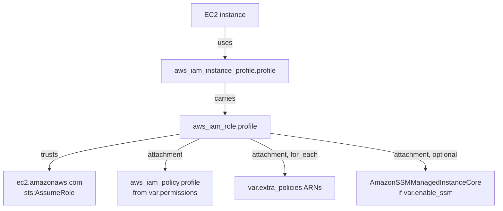

# Architecture

## Overview

The module creates a complete IAM instance profile setup — everything an EC2 instance
needs to obtain AWS credentials via the instance metadata service.

## Resources

| Resource | Purpose |
|----------|---------|
| `aws_iam_role.profile` | The role EC2 instances assume. Trust policy allows `ec2.amazonaws.com` to call `sts:AssumeRole`. |
| `aws_iam_policy.profile` | Permissions policy created from the `permissions` JSON input, plus default statements for `ec2:DescribeTags` and the Inspector CIS session actions. |
| `aws_iam_instance_profile.profile` | The instance profile that carries the role; its name is what you reference from EC2. |
| `aws_iam_role_policy_attachment.profile` | Attaches the permissions policy to the role. |
| `aws_iam_role_policy_attachment.extra` | One attachment per entry in `extra_policies` (`for_each`). |
| `aws_iam_role_policy_attachment.ssm` | Attaches the AWS-managed `AmazonSSMManagedInstanceCore` policy when `enable_ssm = true`. |

## How Credentials Flow

1. An EC2 instance is launched with the instance profile.
2. The EC2 service assumes the role on behalf of the instance (allowed by the role's
   trust policy).
3. Temporary credentials for the role are made available to the instance through the
   instance metadata service (IMDS).
4. Applications on the instance (AWS CLI, SDKs, SSM agent) pick up the credentials
   automatically.

## Naming

AWS enforces different length limits on IAM names, and the module truncates names to fit:

- **Instance profile**: `profile_name`, truncated to 128 characters.
- **Role**: `role_name` if given; otherwise `profile_name` is used as a *name prefix*,
  truncated to 38 characters (Terraform appends a random suffix to guarantee uniqueness).
- **Policy**: `profile_name` used as a name prefix, truncated to 102 characters.

## Tagging

All resources receive `var.tags` plus provenance tags:

- `created_by_module = "infrahouse/instance-profile/aws"` — which module created the
  resource.
- `upstream_module` — the calling module, when `upstream_module` is set.
- `module_version` — stamped on the IAM role only, recording the module version that
  created it.
